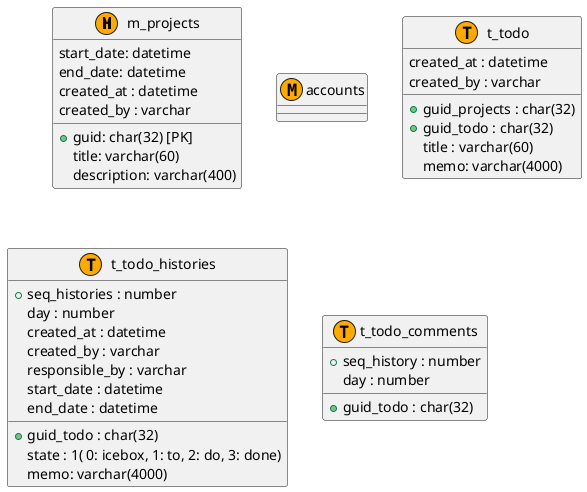

# todo-app

todo管理アプリケーション
進捗の確認やカイゼンジャーニーに記載のプロジェクト進行に必要なツールを持つ
## todoback
### 概要

- バックエンド側のアプリケーション
- Djangoで実装

- pip
  - django
  - routers
  - djangorestframework
  - djangorestframework-jwt
  - django-filter

## todofront
### 概要

- フロントエンド側のアプリケーション
- Reactで実装

## DB

